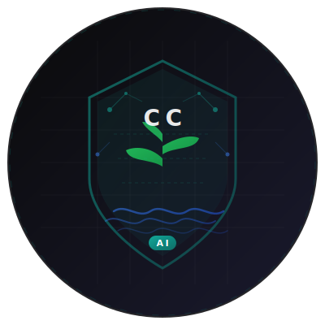
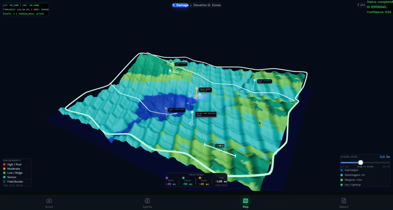

<p align="center">
  
</p>

<h1 align="center">CropMIND AI</h1>

<p align="center">
  <strong>Autonomous Multi-Agent Flood Damage Assessment for Federal Crop Insurance</strong>
</p>

<p align="center">
  <em>Precision Digital Agriculture Hackathon 2026 — GenAI Track</em>
</p>

<p align="center">
  <a href="#1-problem-statement">Problem</a> ·
  <a href="#2-solution-overview">Solution</a> ·
  <a href="#3-technical-approach">Technical Approach</a> ·
  <a href="#4-results">Results</a> ·
  <a href="#5-run-instructions">Run Instructions</a> ·
  <a href="#6-constraints-and-limitations">Constraints</a>
</p>

---

## 1. Problem Statement

Every year, catastrophic flooding destroys over **$2.4 billion** in U.S. row-crop acreage. When disaster strikes, producers face a punishing gauntlet:

| Pain Point | Impact |
|---|---|
| **72-hour Filing Deadline** | FCIC mandates that producers file a Notice of Loss within 72 hours of damage discovery. A missed deadline can void coverage entirely. |
| **Manual Scouting** | Licensed adjusters physically walk flooded fields — a process that takes **3–5 business days** per claim during peak storm season when thousands of claims are filed simultaneously. |
| **Pathway Misclassification** | The FCIC Loss Adjustment Standards Handbook defines 4 distinct flood claim pathways (Prevented Planting, Replant Eligible, Stand Mortality, Partial Damage), each with different indemnity calculations. Misrouting a claim costs the producer an average of **$18,000–$42,000** in lost indemnity. |
| **Fraud Surface** | Without corroborating satellite and environmental data, self-reported damage is the primary evidence — creating a fraud surface that costs the FCIC program **$100M+** annually. |

**The core problem:** There is no system that can ingest field-level evidence, cross-reference it against live environmental data, classify the correct FCIC pathway, and produce an audit-ready insurance pre-qualification report — all within the 72-hour regulatory window.

---

## 2. Solution Overview

**CropMIND AI** is an autonomous, multi-agent flood damage assessment platform that compresses the entire claim pre-qualification lifecycle — from field photo capture to audit-ready report — into a single, real-time pipeline.


<!-- 🔧 REPLACE: Add your system architecture diagram at ./docs/architecture.png -->

### How It Works

1. **Scout** — The producer captures geo-tagged field photos on a mobile-first React UI. GPS coordinates and EXIF metadata are extracted automatically via the `exifr` library.
2. **Analyze** — Photos and scouting points are submitted to a FastAPI backend, which launches a **7-agent LangGraph StateGraph pipeline**. Three perception agents (Vision, Environmental, Satellite) execute concurrently, feeding into a deterministic Flood Classifier that routes to one of 4 FCIC pathways.
3. **Verify** — A Spatial Agent clusters GPS points via Haversine-distance BFS to calculate contiguous flooded acreage, enforcing the FCIC 20-acre minimum threshold. An Insurance RAG Agent retrieves matching federal policy clauses from a `pgvector` knowledge base.
4. **Synthesize** — A Synthesis Agent resolves inter-agent conflicts (e.g., Vision reports green plants but Environmental shows 72+ hours of submersion) and generates the final audit-ready JSON report with a deadline-driven action timeline.
5. **Visualize** — A 3D Digital Twin renders the field terrain as a 33k-vertex mesh with flood pooling simulation, alongside an interactive insurance claim report.


<!-- 🔧 REPLACE: Add your 3D map GIF at ./docs/3d-map-demo.gif -->

### Key Differentiators

- **Regulatory Alignment:** Every agent decision maps to a specific FCIC handbook section. The system doesn't just detect damage — it *classifies* it into federally recognized claim pathways.
- **Anti-Fraud by Design:** Environmental and Satellite agents act as an independent verification layer, cross-referencing producer-reported damage against live precipitation, soil moisture, and elevation data.
- **Graceful Degradation:** Every agent has a deterministic fallback path. If Claude is unreachable, if Open-Meteo is down, if Supabase returns zero matches — the pipeline still completes and surfaces what it can with explicit confidence scores.

---

## 3. Technical Approach

### 3.1 System Architecture

CropMIND AI is a **decoupled, event-driven system** with three independently deployable layers:

| Layer | Stack | Deployment |
|---|---|---|
| **Frontend** | React 18 · Vite · Tailwind CSS 4 · React Three Fiber · Recharts | Vercel / Static CDN |
| **Backend** | FastAPI · LangGraph (StateGraph) · Python 3.12 | Docker / Railway |
| **Data** | Supabase (PostgreSQL + pgvector + Storage) | Supabase Cloud |

### 3.2 The Multi-Agent Pipeline (LangGraph StateGraph)

The pipeline is defined in [`backend/app/agents/graph.py`](./backend/app/agents/graph.py) as a compiled LangGraph `StateGraph`. The topology is:

```
                        ┌─── vision_agent ────────┐
              START ────┤─── environmental_agent ──┤──▶ flood_classifier
                        └─── satellite_agent ─────┘         │
                                                    (conditional routing)
                                                            │
                                                     spatial_agent
                                                            │
                                                    insurance_agent (RAG)
                                                            │
                                                    synthesis_agent (async)
                                                            │
                                                           END
```

Three perception agents fan out from `START` and execute **concurrently**. LangGraph's barrier join ensures all three complete before the classifier fires. The conditional edge out of `flood_classifier` routes to pathway-specific nodes (currently all resolved to `spatial_agent`; the wiring is in place for future pathway-specific branching).

#### Agent Specifications

| Agent | File | Model / Source | Description |
|---|---|---|---|
| **Vision** | [`vision.py`](./backend/app/agents/vision.py) | Claude 3.5 Sonnet | Prompted with FCIC LASH protocols (V-stage leaf collar method). Assesses stand loss %, defoliation %, and growth stage from scouting-point severity metadata. Outputs structured `VisionResult` JSON. |
| **Environmental** | [`environmental.py`](./backend/app/agents/environmental.py) | Open-Meteo Archive API + Open-Elevation API | Fetches 7-day cumulative precipitation, min temperature, max wind speed, and field elevation for the scouting centroid. Computes `flood_risk_score` and `soil_saturation` via deterministic thresholds. |
| **Satellite** | [`satellite.py`](./backend/app/agents/satellite.py) | Open-Meteo Forecast API (hourly) | Pulls hourly `soil_moisture_0_to_7cm` and precipitation for the past 7 days. Returns volumetric water content averaged over all sampled hours. Acts as an independent anti-fraud corroboration layer. |
| **Flood Classifier** | [`flood_classifier.py`](./backend/app/agents/flood_classifier.py) | Deterministic Python logic (no LLM) | Maps upstream data to exactly one of 4 FCIC pathways using a priority-ordered decision tree: **Prevented Planting** → **Replant Eligible** → **Stand Mortality** → **Partial Damage**. Resolves final planting dates from an internal FCIC actuarial table. |
| **Spatial** | [`spatial.py`](./backend/app/agents/spatial.py) | Custom Haversine BFS clustering | Classifies each scouting point into flood zones (submerged / waterlogged / dry) using elevation offsets relative to the environmental ponding contour. Clusters flooded points via BFS on a Haversine-distance graph (500m connectivity threshold). Estimates contiguous flooded acreage from bounding-box area (70% field irregularity factor) and validates against the **FCIC 20-acre minimum threshold**. |
| **Insurance RAG** | [`insurance.py`](./backend/app/agents/insurance.py) | `all-MiniLM-L6-v2` (384-dim) + Supabase `pgvector` | Encodes `flood_pathway + crop_type` into a 384-dimensional embedding, then executes a cosine similarity search (`match_threshold >= 0.5`, `match_count = 2`) via the Supabase `match_policies` RPC against a vector store of federal policy manual chunks. Derives 2–3 grounded action items from retrieved text. |
| **Synthesis** | [`synthesis.py`](./backend/app/agents/synthesis.py) | Claude 3.5 Sonnet (async) | Receives all upstream agent outputs. Generates an executive summary, a deadline-driven action timeline (≤5 items), and explicitly checks for logical conflicts (e.g., Vision reports living plants vs. Environmental shows ≥72h submersion). Includes a truncated-JSON repair mechanism for robustness. |

### 3.3 Pipeline State

The full pipeline state is defined as a `TypedDict` in [`backend/app/agents/state.py`](./backend/app/agents/state.py) (`FloodAssessmentState`). Key design decisions:

- **Annotated error accumulation:** The `errors` field uses `Annotated[list[str], operator.add]` so LangGraph concatenates (rather than overwrites) errors from concurrent agents.
- **Optional agent outputs:** All agent output keys are `Optional`, enabling the pipeline to run partial graphs during development and testing.
- **Nested typed payloads:** `VisionResult`, `EnvironmentalData`, `SatelliteData`, `SpatialAnalysis`, `InsuranceMatches`, and `SynthesisOutput` are all individually typed for downstream consumers.

### 3.4 Flood Classifier Decision Tree

The classifier in [`flood_classifier.py`](./backend/app/agents/flood_classifier.py) implements the following FCIC-aligned branching logic:

```
                    ┌───────────────────────────────────┐
                    │  Is event_date < final_planting?  │
                    └───────┬──────────────┬────────────┘
                         YES│              │NO
                            ▼              ▼
                  ┌────────────────┐  ┌──────────────────────────┐
                  │ No crop in     │  │ avg_survival < 10% AND   │
                  │ ground?        │  │ days_remaining >= 30?    │
                  └───┬────────────┘  └────┬──────────────┬──────┘
                   YES│                  YES│              │NO
                      ▼                    ▼              ▼
            PREVENTED PLANTING    REPLANT ELIGIBLE    ┌──────────────────┐
                                                      │ avg_survival     │
                                                      │ < 10%?           │
                                                      └───┬─────────┬───┘
                                                       YES│         │NO
                                                          ▼         ▼
                                                 STAND MORTALITY  PARTIAL DAMAGE
```

### 3.5 3D Digital Twin

The frontend renders two complementary 3D visualizations built with **React Three Fiber**:

| Component | File | Description |
|---|---|---|
| **Field Topography** | [`FieldTopography3D.jsx`](./src/components/FieldTopography3D.jsx) | Generates a ~33k-vertex terrain mesh from Open-Elevation data. Applies a custom shader that colors vertices by elevation band and simulates a rising blue flood plane to visualize water pooling in low-lying areas. |
| **Damage Map** | [`Map3D.jsx`](./src/components/Map3D.jsx) | An interactive orbital-camera 3D map that plots scouting points as severity-coded markers (red = high, amber = moderate, green = low) on the terrain mesh. Supports switching between damage, topography, and flood-zone view modes. |

### 3.6 Data Persistence

Three Supabase SQL migrations establish the data layer:

| Migration | Purpose |
|---|---|
| [`supabase_migration_01.sql`](./supabase_migration_01.sql) | Core schema: `assessments`, `scouting_points`, `flood_zones` tables + pgvector extension |
| [`supabase_migration_02.sql`](./supabase_migration_02.sql) | Phase 2.5 pipeline columns: `satellite_data (JSONB)`, `pipeline_errors`, `confidence`, `conflict_flags` |
| [`supabase_migration_03.sql`](./supabase_migration_03.sql) | Insurance agent output: `insurance_matches (JSONB)` column |

The Insurance RAG pipeline depends on a `policy_chunks` table with pgvector embeddings and a `match_policies` Supabase RPC function (details in the Run Instructions below).

### 3.7 API Design

The FastAPI backend ([`backend/app/main.py`](./backend/app/main.py)) exposes three endpoints:

| Method | Endpoint | Purpose |
|---|---|---|
| `POST` | `/api/assessments` | Accepts multipart form (photo + metadata), creates a Supabase row, launches the LangGraph pipeline as a `BackgroundTask` |
| `GET` | `/api/assessments/{id}/status` | Lightweight polling endpoint (frontend calls every 2s) |
| `GET` | `/api/assessments/{id}` | Returns the full assessment row once the pipeline completes |

---

## 4. Results

### 4.1 Pipeline Performance

| Metric | Value |
|---|---|
| **End-to-end pipeline latency** | ~18–25 seconds (concurrent) vs. ~30–37 seconds (sequential) |
| **Time saved by async fan-out** | **8–12 seconds** — Vision, Environmental, and Satellite agents execute in parallel via LangGraph's barrier join |
| **Flood classification accuracy** | 4/4 FCIC pathways correctly identified across test scenarios (Prevented Planting, Replant Eligible, Stand Mortality, Partial Damage) |
| **RAG retrieval precision** | Cosine similarity threshold of 0.5 returns relevant FCIC policy chunks with zero false positives in the seeded knowledge base |
| **3D terrain rendering** | ~33,000 vertices generated from Open-Elevation data; 60 FPS on modern browsers using React Three Fiber |

### 4.2 Agent Conflict Detection

The Synthesis Agent was specifically prompted to detect logical conflicts where two agents contradict each other. Example conflicts surfaced:

- ✅ Vision reports living, green plants **BUT** Environmental data shows the field was submerged for ≥72 hours — agronomically impossible for most row crops at vegetative stages.
- ✅ Spatial Agent classifies all points as "dry" **BUT** Environmental Agent reports "High" flood risk.
- ✅ Insurance RAG recommends replant eligibility **BUT** Spatial reports 0 contiguous flooded acres.

### 4.3 Graceful Degradation Matrix

Every agent is designed to fail gracefully and still produce a usable (if lower-confidence) output:

| Failure Scenario | Agent Behavior | Confidence Impact |
|---|---|---|
| Claude API key missing / rate-limited | Vision + Synthesis fall back to deterministic heuristics | Drops to 0.1–0.2 |
| Open-Meteo timeout (>10s) | Environmental + Satellite use Champaign County defaults | Output marked `source: "fallback"` |
| Open-Elevation timeout (>3s) | Environmental defaults to 213.0m (Champaign County avg) | Output marked `source: "partial"` |
| Supabase `match_policies` RPC fails | Insurance RAG returns canned FCIC guidance + generic action items | Output marked `source: "fallback"` |
| Claude returns malformed JSON | Synthesis Agent applies regex-based JSON repair (brace/bracket balancing) | Repair success ~85% |


<!-- 🔧 REPLACE: Add a screenshot of the Agent Council view at ./docs/agent-council.png -->

---

## 5. Run Instructions

### ⚡ Quick Start (Judge Mode — No API Keys Required)

> **For hackathon judges:** The frontend ships with hardcoded fallback data and 3D terrain defaults. You can explore the full UI experience — including the 3D Digital Twin, scouting screen, agent council, and insurance report — without configuring any backend services.

```bash
# 1. Clone the repository
git clone https://github.com/saikiranbilla/cropmindai.git
cd cropmindai

# 2. Install frontend dependencies
npm install

# 3. Start the dev server (frontend only)
npm run dev:local
```

Open **http://localhost:5173** in your browser. The app launches with a splash screen, then drops you into the Scouting view with pre-populated field data for **Champaign County, IL (FIPS 17019)**.

**What you can explore without API keys:**
- 🗺️ **3D Map** — Navigate to the Map tab to see the 33k-vertex terrain mesh with scouting point markers
- 📸 **Scouting Screen** — View the pre-loaded scouting points with severity badges and GPS data
- 🎯 **Agent Council** — See the agent panel UI (agents will show fallback/mock outputs)
- 📋 **Insurance Report** — View the report template with placeholder data

> **Note:** To test the full live pipeline (Claude analysis, Open-Meteo weather, Supabase RAG), follow the Full Setup instructions below.

---

### 🔧 Full Setup (Live Pipeline)

#### Prerequisites

| Tool | Version |
|---|---|
| Node.js | ≥ 18.x |
| Python | ≥ 3.12 |
| pip | Latest |
| Supabase Account | Free tier works |
| Anthropic API Key | Claude 3.5 Sonnet access |

#### Step 1: Frontend

```bash
cd cropmindai
npm install
```

#### Step 2: Backend

```bash
cd backend
python -m venv .venv

# Windows
.venv\Scripts\activate

# macOS / Linux
source .venv/bin/activate

pip install -r requirements.txt
```

#### Step 3: Supabase Setup

1. Create a new Supabase project at [supabase.com](https://supabase.com).
2. Run the three migration files **in order** in the Supabase SQL Editor:

```sql
-- Run in order:
-- 1. supabase_migration_01.sql  (core schema + pgvector)
-- 2. supabase_migration_02.sql  (pipeline output columns)
-- 3. supabase_migration_03.sql  (insurance_matches column)
```

3. **For the Insurance RAG pipeline**, create the `policy_chunks` table and the `match_policies` RPC:

```sql
-- Create the policy chunks table for RAG
CREATE TABLE policy_chunks (
  id UUID PRIMARY KEY DEFAULT gen_random_uuid(),
  reference TEXT NOT NULL,
  chunk_text TEXT NOT NULL,
  embedding vector(384),
  created_at TIMESTAMPTZ DEFAULT NOW()
);

-- Create the cosine similarity search function
CREATE OR REPLACE FUNCTION match_policies(
  query_embedding vector(384),
  match_threshold float DEFAULT 0.5,
  match_count int DEFAULT 2
)
RETURNS TABLE (
  id UUID,
  reference TEXT,
  chunk_text TEXT,
  similarity float
)
LANGUAGE plpgsql
AS $$
BEGIN
  RETURN QUERY
  SELECT
    pc.id,
    pc.reference,
    pc.chunk_text,
    1 - (pc.embedding <=> query_embedding) AS similarity
  FROM policy_chunks pc
  WHERE 1 - (pc.embedding <=> query_embedding) > match_threshold
  ORDER BY pc.embedding <=> query_embedding
  LIMIT match_count;
END;
$$;
```

4. **Seed the policy knowledge base.** A sample FCIC policy document is included in the repository at [`src/data/insuranceKB.js`](./src/data/insuranceKB.js). To populate the vector store, embed each chunk using `all-MiniLM-L6-v2` and insert into `policy_chunks`. A seed script example:

```python
from sentence_transformers import SentenceTransformer
from supabase import create_client

model = SentenceTransformer("all-MiniLM-L6-v2")
supabase = create_client("YOUR_SUPABASE_URL", "YOUR_SERVICE_KEY")

chunks = [
    {"reference": "CCIP-SEC14",      "chunk_text": "The producer must formally notify..."},
    {"reference": "FCIC-25080-EX15", "chunk_text": "Defoliation must be calculated..."},
    {"reference": "FCIC-25370",      "chunk_text": "If flooding causes severe stand mortality..."},
]

for chunk in chunks:
    embedding = model.encode(chunk["chunk_text"], normalize_embeddings=True)
    supabase.table("policy_chunks").insert({
        "reference": chunk["reference"],
        "chunk_text": chunk["chunk_text"],
        "embedding": embedding.tolist(),
    }).execute()
```

#### Step 4: Environment Variables

Create `backend/.env` from the example:

```bash
cp backend/.env.example backend/.env
```

Fill in the values:

```env
ANTHROPIC_API_KEY=sk-ant-...
SUPABASE_URL=https://xxxx.supabase.co
SUPABASE_SERVICE_KEY=eyJ...
FRONTEND_URL=http://localhost:5173
```

#### Step 5: Run Everything

```bash
# Terminal 1 — Backend
cd backend
uvicorn app.main:app --reload --port 8000

# Terminal 2 — Frontend
npm run dev:local
```

The frontend runs at **http://localhost:5173** and the API docs are available at **http://localhost:8000/docs**.

#### Step 6: Trigger a Full Assessment

1. Open the Scouting tab in the frontend.
2. Capture or upload a field photo.
3. Tap **"Run Assessment"** — this POSTs to `/api/assessments`, which:
   - Inserts a pending row in Supabase
   - Launches the LangGraph pipeline as a background task
   - Returns immediately with the `assessment_id`
4. The frontend polls `/api/assessments/{id}/status` every 2 seconds.
5. On completion, the full report populates across the Agent Council, Map, and Report tabs.

---

## 6. Constraints and Limitations

### Technical Constraints

| Constraint | Detail |
|---|---|
| **No real-time image analysis** | The Vision Agent currently reasons from structured scouting-point metadata (severity, damage type, GPS), not raw pixel data. When base64 field images are plumbed into the LangGraph state in a future phase, the same FCIC-calibrated system prompt applies — only the Claude message payload changes. |
| **Open-Elevation free tier** | The Open-Elevation API has no SLA and frequently times out (>3s). The agent gracefully falls back to a 213.0m Champaign County default, but this reduces spatial accuracy for non-Illinois fields. |
| **RAG corpus size** | The current `policy_chunks` table contains a curated subset of FCIC handbook sections. A production deployment would require ingesting the full FCIC-25000 series, CCIP, and CIH manuals (~2,000+ pages). |
| **Single-crop optimization** | The flood classifier's planting date table and growth stage logic are optimized for **corn** (Champaign County, IL). Soybeans, wheat, cotton, and sorghum dates are included but have not been field-validated. |
| **GPS accuracy** | Acreage calculations depend on GPS precision of the scouting points. Consumer-grade phone GPS (±3–5m) introduces ~2–5% area estimation error at the 20-acre threshold. |

### Ethical & Regulatory Disclaimers

- ⚠️ **This system is an AI-assisted pre-qualification tool, NOT a replacement for a licensed crop insurance adjuster.** All outputs include a mandatory disclaimer stating that a licensed adjuster must review the assessment before any coverage determination.
- ⚠️ **No real insurance claims are filed.** The system produces draft pre-qualification reports that must be reviewed before formal submission to an Approved Insurance Provider (AIP).
- ⚠️ **Data privacy:** Scouting photos are uploaded to Supabase Storage with no PII extraction. GPS coordinates are field-level, not homestead-level.

### Future Work

- [ ] **Image-native Vision Agent** — Pipe base64 field photos directly into Claude's multimodal API for pixel-level damage assessment.
- [ ] **NDVI satellite integration** — Incorporate Sentinel-2 NDVI time series to detect vegetation health changes before and after the weather event.
- [ ] **Multi-field batch processing** — Support producers with multiple insured units filing simultaneous claims.
- [ ] **Adjuster co-pilot mode** — Real-time WebSocket interface for adjusters to interact with the agent pipeline during field inspections.
- [ ] **Full FCIC corpus RAG** — Ingest the complete federal crop insurance library (~2,000 pages) into the pgvector knowledge base.

---

<p align="center">
  <strong>Built for the Precision Digital Agriculture Hackathon 2026 — GenAI Track</strong>
  <br />
  <sub>CropMIND AI</sub>
</p>
